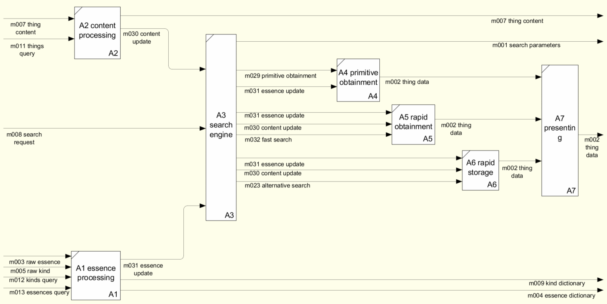

# Архитектура

## Оглавление
- [Введение](./../readme.md)
- [Варианты использования](./use-case.md)
- [Преимущества от использования](./benefits.md)
- [Подготовка к использованию](./preparatory-steps.md)
- [Архитектура](./inner-workings.md)
- [Дополнительные материалы](./additional.md)

## Аннотация
Документ описывает внутренние процессы информационной системы
"Хранилище для всего" (основана на библиотеке "Универсальный каталог")

## Услуги (варианты использования)

### S001 Создать модель (предмет) с произвольными характеристиками

- S001A1S01 создать сущность
- S001A1S02 задать свойства сущности
- S001A1S03 создать характеристику
- S001A1S04 задать свойства характеристики
- S001A1S05 задать сущности характеристику
- S001A4S01 сформировать запрос на создание представления
- S001A4S02 создать представление
- S001A2S01 создать экземпляр сущности
- S001A2S02 задать значения для характеристики экземпляра
- S001A4S04 получить данные из представления 

### S002 Выполнить поиск моделей по заданным характеристикам

- S002A4S03 определить возможные условия для поиска
- S002A4S04 сделать выборку экземпляров по заданным условиям поиска 
(поиск в представлении)

### E005 Создать структуру для быстрого поиска

- E005A5S01 сформировать запрос на создание материализованного 
представления и индексов
- E005A5S02 создать материализованное представление и индексы

### E006 Обновить данные для быстрого поиска

- E006A2S03 изменить значение характеристики экземпляра
- E006A5S03 обновить данные в материализованном представлении

### S003 Выполнить быстрый поиск

- S002A5S04 определить возможные условия для поиска
- S002A5S05 сделать выборку экземпляров по заданным условиям поиска 
(поиск в представлении)

### E007 Создать структуру для быстрого обновления

- E007A6S01 сформировать запрос на создание таблицы и индексов
- E007A6S02 создать таблицу и индексы
- E007A6S04 заполнить таблицу

### S004 Выполнить быстрое обновление

- E006A2S03 изменить значение характеристики экземпляра
- S004A6S03 обновить данные в таблице

## Модули

### A1 essence processing

обработка сущностей

### A2 content processing

обработка содержимого

### A3 search engine

движок поиска

### A4 direct reading

прямое чтение (view)

### A5 rapid obtainment

быстрое получение (materialized view)

### A6 rapid recording

быстрая запись (table)

### A7 outputting

вывод результатов поиска
